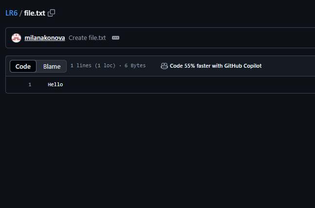
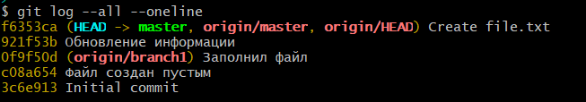
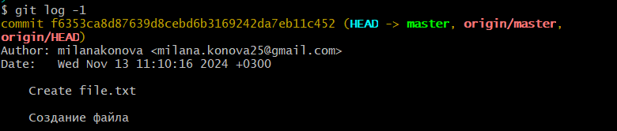
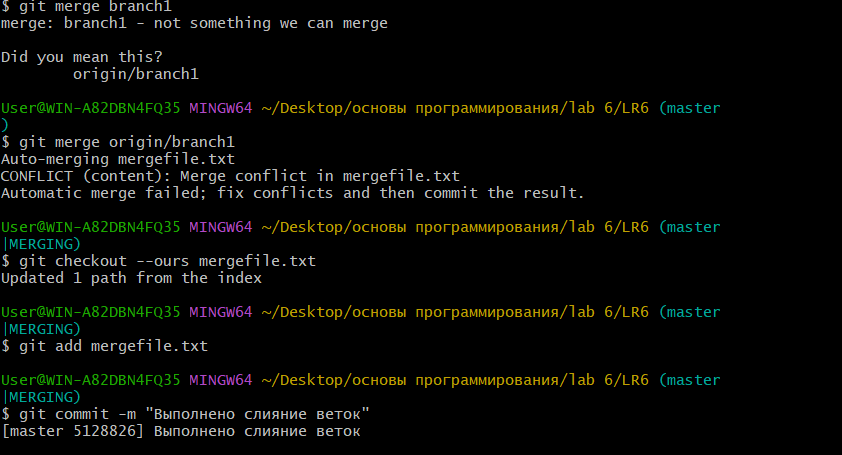
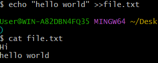
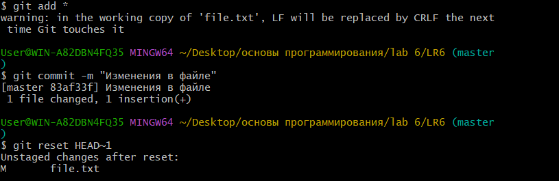
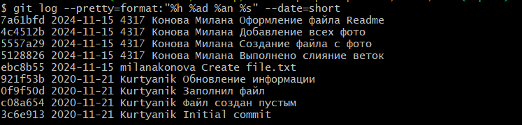

# LR6
Лабораторная работа №6

# Отчет по работе с Git

## 1. Создание форка

## 2. Изменение имени пользователя
Команда для изменения имени пользователя:

```bash
$ git config --global user.name "4317 Конова Милана"
```
Команда для изменения имени пользователя:
```bash
$ git config --global user.email"milana.konova25@gmail.com"  
```

## 3. Клонирование репозитория

```bash
$ git clone https://github.com/milanakonova/LR6
```

## 4. Добавление нового файла
*Скриншет с добавлением нового файла*


## 5. Добавление изменений в локальный репозиторий

```bash
$ git pull
```

## 6. Получение данных для каждой из веток

```bash
$ git log --all –oneline
```

*Результат работы команды*



## 7. Просмотр последних изменений

```bash
$ git log -1
```

*Результат работы команды*



## 8. Слияние веток и решение конфликта



## 9. Удаление побочной ветки после слияния

```bash
$ git push origin :branch1
```

## 10. Откат коммита





## 11. Создание ветки для отчета

```bash
$ git checkout -b report
```

## 12. Получение истории операций в форматированном виде

```bash
$ git log --pretty=format:"%h %ad %an %s" --date=short
```

## 13. История операций


